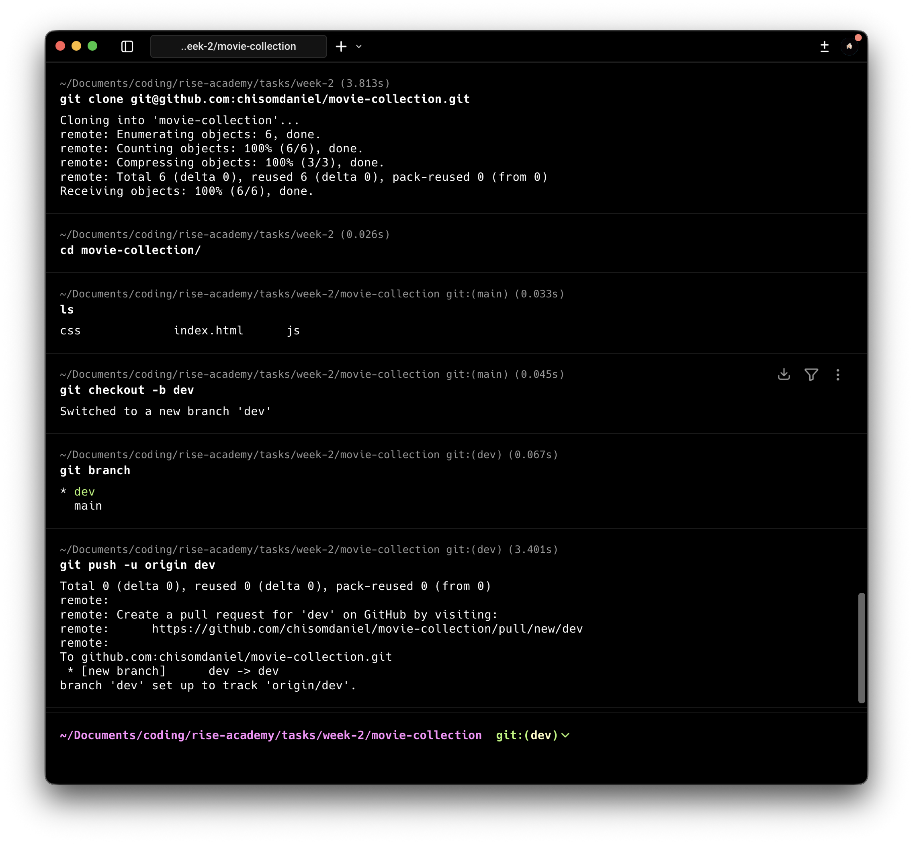
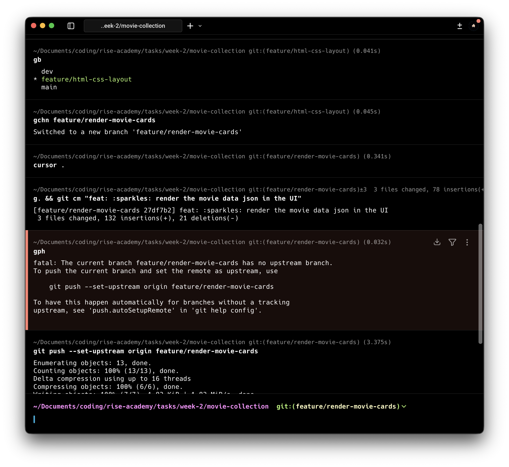
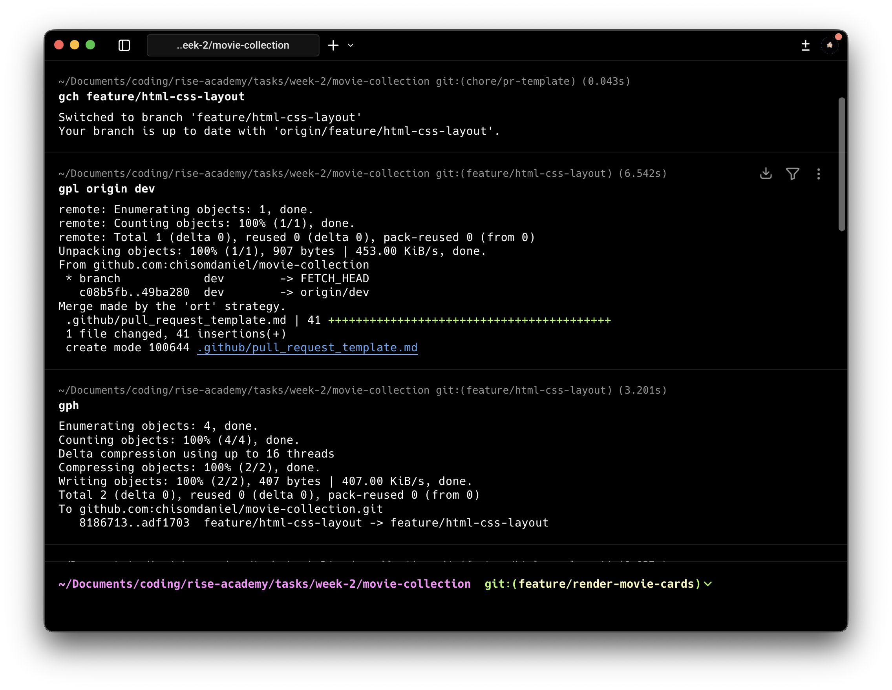
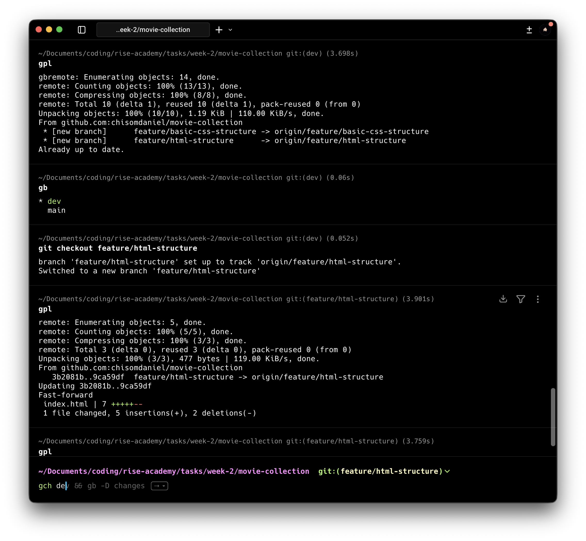

# 🎬 Movie Collection

A collaborative frontend project built as part of **Rise Academy – Week 2 Tasks**. The Movie Collection app displays a curated list of movies using clean HTML, CSS, and JavaScript, with a structured Git workflow and team-based collaboration.

---

## 📦 Project Setup Instructions

### Prerequisites

* Git
* A modern web browser (Chrome, Firefox, Edge)
* Code editor (VS Code recommended)

### Clone the Repository

```bash
git clone https://github.com/chisomdaniel/movie-collection.git
cd movie-collection
```

### Run the Project

This is a static frontend project. No build tools are required.

* Open `index.html` directly in your browser
* OR use VS Code Live Server extension for a better dev experience

---

## 🛠️ Available CLI Commands Used

Below are the key Git commands used during development:

```bash
# Branching
git checkout -b feature/html-css-layout
git checkout -b feature/render-movie-cards

# Status & history
git status
git branch
git log --oneline

# Syncing branches
git pull origin dev
git push origin <branch-name>

# Commit & push
git add .
git commit -m "feat: render movie cards"
git push --set-upstream origin <branch-name>

# Cleanup
git branch -D chore/pr-template
```

---

## 🌿 Git Workflow Steps

The project followed a **feature-branch workflow**:

1. `main` – stable production-ready branch
2. `dev` – integration branch
3. `feature/*` – isolated feature development

### Workflow

1. Create a feature branch from `dev`
2. Implement changes
3. Commit with meaningful messages
4. Push feature branch to GitHub
5. Open a Pull Request targeting `dev`
6. Review, merge, and sync branches

#### Workflow screenshots

Screenshots for the Git workflow live in [`screenshots/`](screenshots/):

| Step | Screenshot |
|------|------------|
| Start workflow |  |
| Create feature branch & push |  |
| Pull from `dev` |  |
| Pull from remote branch |  |

A PR template was added under:

```
.github/pull_request_template.md
```

To standardize reviews and collaboration.

---

## ✨ Feature List

* Responsive movie card layout
* Dynamic rendering of movie data from JSON
* Clean separation of concerns (HTML, CSS, JS)
* Reusable UI components
* Standardized pull request template

---

## ⚙️ Implementation Details

### HTML

* Semantic structure for accessibility
* Movie container acts as a render target

### CSS

* Grid/Flexbox used for layout
* Consistent spacing and typography
* Scalable styles for additional movies

### JavaScript

* Movie data stored as JSON
* DOM manipulation used to dynamically render movie cards
* Iterative rendering for scalability

---

## 👥 Team Member Contributions

### Chisom Daniel

* Repository setup
* Core project coordination
* GitHub management
* PR revision

### Ejemen Iboi

* HTML/CSS layout implementation
* PR template creation
* Movie card rendering logic
* Git workflow enforcement

---

## 📚 Lessons Learned from Collaboration

* Importance of a shared branching strategy
* PR templates significantly improve review quality
* Pulling from `dev` early prevents merge conflicts
* Clear commit messages save time during reviews
* Communication matters as much as code

Collaboration turned individual effort into a cohesive product.

---

## 🔗 Links

* Repository: [https://github.com/chisomdaniel/movie-collection](https://github.com/chisomdaniel/movie-collection)
* Pull Requests: [https://github.com/chisomdaniel/movie-collection/pulls](https://github.com/chisomdaniel/movie-collection/pulls)
